# hs-nano-stack (`hsns`)

[](https://github.com/Todoviernes/hs-nano-stack/actions/workflows/smoke.yml) [](LICENSE) [](https://docs.anthropic.com/claude-code)

A Claude Code plugin that ports the [garagon/nanostack](https://github.com/garagon/nanostack) phase-gated AI workflow into a domain-specialized stack for **HubSpot CMS Hub** development — themes, landing pages, modules, and email templates, written in HubL on top of vanilla CSS variables.

> **Why.** Generalist AI agents leak in three predictable ways on HubSpot: HubL syntax mistakes, schema drift between `theme.json` / `fields.json` / `meta.json`, and skipped marketplace + Core Web Vitals gates. `hsns` solves all three with a phase chain that reads upstream artifacts and refuses to drift.

## How it works at a glance

```mermaid
flowchart LR
    T["/hsns:think"] -->|writes| TH[("think.json")]
    TH -->|reads| N["/hsns:nano"]
    N -->|writes| PL[("plan.json")]
    PL -->|reads| B["/hsns:build"]
    B -->|writes| SRC[("source files")]
    PL -.->|drift check| R["/hsns:review"]
    SRC -->|reads| R
    R -->|writes| RV[("review.json")]
    RV -->|reads| S["/hsns:security"]
    S -->|writes| SEC[("security.json")]
    SEC -->|reads| Q["/hsns:qa"]
    RV -->|reads| Q
    Q -->|writes| QA[("qa.json")]
    QA -->|gates| SH["/hsns:ship"]
    SEC -->|gates| SH
    SH -->|writes| SHIP[("ship.json + journal.md")]

    ADR[("ADR log<br/><i>read by every phase</i>")] -.->|context| T
    ADR -.->|context| N
    ADR -.->|context| B
    ADR -.->|context| R

    classDef phase fill:#0F172A,stroke:#3B82F6,color:#fff;
    classDef art fill:#F8FAFC,stroke:#94A3B8,color:#0F172A;
    classDef adr fill:#EEF2FF,stroke:#7C3AED,color:#0F172A;
    class T,N,B,R,S,Q,SH phase;
    class TH,PL,SRC,RV,SEC,QA,SHIP art;
    class ADR adr;
```



Once approved, every artifact is marked `frozen: true` — downstream phases must read it and produce consistent output. Spec changes go through `change-requests/`, not silent edits. Non-trivial decisions land in `decisions/NNNN-slug.md` and are read before every phase generates.

📐 **Full architecture with discipline-loop and branching diagrams: [`docs/ARCHITECTURE.md`](docs/ARCHITECTURE.md).**

## The seven commands

| Command | What it does | Writes |
|---|---|---|
| `/hsns:think` | CRO/marketer challenges scope: conversion goal, KPI, persona, traffic source | `.hs-nano/think/<TS>.json` |
| `/hsns:nano` | Engineering-manager spec: module map, theme fields, files planned | `.hs-nano/plan/<TS>.json` |
| `/hsns:build` | Scaffolds HubL files, `fields.json`, `meta.json`, `theme.json` from frozen plan | source files |
| `/hsns:review` | HubL correctness, schema integrity, scope-drift detection vs plan | `.hs-nano/review/<TS>.json` |
| `/hsns:security` | HubL XSS, `\|safe` audit, secrets in `module.js`, OWASP for forms | `.hs-nano/security/<TS>.json` |
| `/hsns:qa` | `scripts/hs-validate.sh`, `hs upload --dry-run`, Lighthouse, screenshots, a11y | `.hs-nano/qa/<TS>.json` |
| `/hsns:ship` | `hs upload` to sandbox → preview → optional `--promote` to prod, sprint journal | `.hs-nano/ship/<TS>.json` |

Plus: `/hsns:feature` (additive change, skips `/think`), `/hsns:help` (one-pager).

## Install

### Option A — From GitHub (recommended)

```bash
# 1. HubSpot CLI 8.2.0+ (required for MCP)
npm install -g @hubspot/cli@latest
hs --version

# 2. Add the marketplace + install the plugin
claude plugins marketplace add Todoviernes/hs-nano-stack
claude plugins install hsns@hs-nano-stack

# 3. (Optional, recommended) Wire HubSpot's Developer MCP into Claude Code
hs mcp setup --client claude

# Restart Claude Code so the plugin commands and MCP tools register.
```

### Option B — From a local clone (for plugin development)

```bash
git clone https://github.com/Todoviernes/hs-nano-stack
cd hs-nano-stack
claude plugins marketplace add "$(pwd)"
claude plugins install hsns@hs-nano-stack
```

After install, `claude plugins list` should show `hsns@hs-nano-stack`.

The MCP install adds 19 HubSpot tools (`search-docs`, `fetch-doc`, `create-test-account`, `create-cms-module`, etc.) that the phases use opportunistically. See [docs/MCP-SETUP.md](docs/MCP-SETUP.md).

## Updating

```bash
claude plugins marketplace update hs-nano-stack
claude plugins update hsns@hs-nano-stack
# Restart Claude Code to apply.
```

## Quickstart

```bash
mkdir my-landing && cd my-landing
git init

# In Claude Code:
/hsns:think                    # scope a landing page; writes & freezes the brief
/hsns:nano                     # produces module map + files_planned; you approve, it freezes
/hsns:build                    # scaffolds HubL/JSON files
/hsns:review                   # checks scope drift, HubL correctness, schema integrity
/hsns:security                 # HubL XSS, secrets, CSP audit
/hsns:qa                       # scripts/hs-validate.sh + Lighthouse + screenshots
/hsns:ship --account=sandbox   # uploads to sandbox portal, generates sprint journal
/hsns:ship --account=prod --promote   # promotes to production after sandbox QA
```

## How the loop stays disciplined

1. **Frozen artifacts.** Once you approve `/hsns:think` or `/hsns:nano`, the JSON is marked `"frozen": true`. Downstream phases must read it and produce consistent output.
2. **Change requests, not silent edits.** When a phase needs to change the spec, it writes `.hs-nano/change-requests/<TS>.json` and asks you. On approval, a new versioned artifact is written; the old one is marked `superseded_by`.
3. **ADR log.** Non-trivial decisions land in `.hs-nano/decisions/NNNN-slug.md`. Every command reads them before generating, so prior choices survive across sessions.
4. **Schema-grounded scaffolds.** `fields.json` keys and `{{ module.<key> }}` references are diffed by `scripts/fields-schema-check.sh`. Mismatch fails review.
5. **No memorized HubL.** When in doubt about a filter or field type, the agent uses `mcp__hubspot__search-docs` / `mcp__hubspot__fetch-doc` (when MCP is installed) or falls back to `reference/hubl-cheatsheet.md` and `reference/artifact-schema.md` — never guesses from training data.

## Setup the HubSpot CLI

See `reference/setup-hs-cli.md` for the full one-time + per-portal flow. Short version:

```bash
hs init                       # writes hubspot.config.yml — auto-added to .gitignore
hs auth                       # add additional portals (sandbox + prod typical)
hs accounts list              # confirm
```

## Versioning & branching

- **Plugin (`plugin.json`):** SemVer. Annotated tags `vX.Y.Z`. `CHANGELOG.md` follows Keep-a-Changelog.
- **Themes (`theme.json`):** SemVer; `/hsns:ship` auto-bumps from review-artifact diff classification.
- **Modules (`module.meta.json`):** integer version per module, bumped on relevant change.
- **Branching (consumer repos):** `main` ≡ production portal · `staging` ≡ sandbox portal · `feat/*` for sprints.
- **Commits:** Conventional Commits (`feat:`, `fix:`, `docs:`, `chore:`, `refactor:`, `test:`).

See `docs/CONTRIBUTING.md` for the full rules.

## Targets supported in v0.1

- ✅ CMS Hub themes (full theme starter under `reference/theme-starter/`)
- ✅ Landing pages (drag-drop areas, hero/features/CTA/form recipes)
- ✅ Reusable HubSpot modules (marketplace-shaped `module.html` + `fields.json` + `meta.json`)
- ✅ Email templates (`promotional`, `transactional` — restricted CSS, no JS, mandatory tokens)

## Out of scope for v0.1 (named non-goals)

Serverless functions / private apps · Litmus-style cross-client email previews · `/conductor` parallel execution · `/compound` solution graduation · `guard/rules.json` six-tier safety layer · multi-portal deployment matrix · marketplace-submission packaging.

## License

Apache-2.0. nanostack patterns adapted with attribution.
