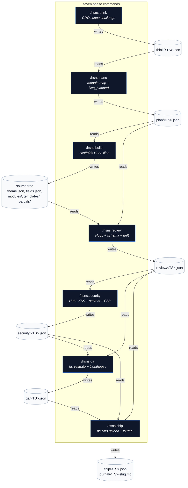
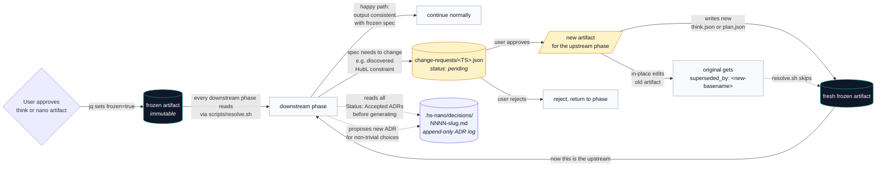
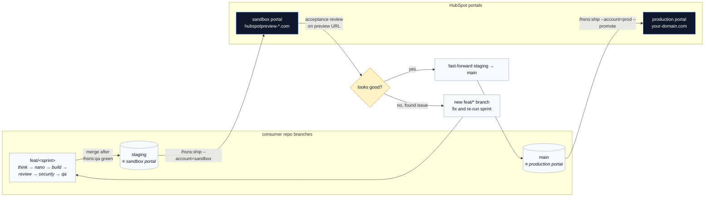

# Architecture

Three diagrams. Each owns one mental model — read top to bottom.

---

## 1. The phase pipeline

The headline mechanic: seven slash commands, each reading upstream JSON artifacts and writing its own. The chain is what makes `/hsns:review` able to detect scope drift mechanically — it just reads `plan.files_planned` and diffs against the working tree.



**Reading rule.** Every command opens with a `READ THESE FIRST` block that calls `scripts/resolve.sh <phase>` for every upstream phase. If the resolver returns empty (no artifact yet), the command refuses to run and tells the user which earlier phase to complete.

**Gating rule.** `/hsns:ship` requires `review.summary.blocking == 0`, `security.grade >= C`, and a `qa` artifact whose timestamp is fresher than the latest source-file modification time. Stale QA → refused ship.

---

## 2. The discipline loop — freeze, supersede, ADR, change-request

This is what stops the agent from silently inventing new modules mid-sprint or "fixing" a frozen plan without your approval. The discipline isn't behavioral; it's structural — the artifacts have a `frozen` flag, a `superseded_by` pointer, and the ADR log is read before every phase.



**Three guarantees this gives you:**

1. **No silent rewrites.** A frozen artifact never changes in place. Edits go through change-request → new artifact → old marked `superseded_by`. `git log .hs-nano/` is a complete decision audit trail.
2. **Resolution always returns the live spec.** `scripts/resolve.sh` walks newest-first and skips any artifact with `superseded_by` set, so downstream phases automatically see the latest non-superseded version.
3. **Decisions survive sessions.** ADRs in `.hs-nano/decisions/` are read by every command before generating. New session, same constraints.

**Where the artifacts live (for orientation):**

```
.hs-nano/
├── think/<TS>.json              ← scope brief
├── plan/<TS>.json               ← module map, files_planned, content_schema
├── review/<TS>.json             ← findings + diff_classification
├── security/<TS>.json           ← HubL XSS, secrets, grade A-F
├── qa/<TS>.json                 ← hs-validate, Lighthouse, screenshots
├── ship/<TS>.json               ← upload result, version bumps, tag
├── change-requests/<TS>.json    ← pending mid-flight scope changes
├── decisions/NNNN-slug.md       ← ADRs (Status: Accepted | Superseded by NNNN)
└── journal/<TS>-<slug>.md       ← human-readable sprint summary (written on ship)
```

---

## 3. Branching & portal-promotion model

The branching strategy mirrors **portal state**, not dev convenience. A glance at git tells you what's live where.



**Tags pin what's live.** Each `/hsns:ship` writes an annotated tag of the form `theme/<theme-name>/v<X.Y.Z>-<account>`, so `git log --all --tags` produces a portal-by-portal deployment ledger.

**Versioning is two-axis.** The plugin (`plugin.json`) is SemVer per the rules in [`docs/CONTRIBUTING.md`](CONTRIBUTING.md). The HubSpot content (`theme.json` and per-module `meta.json`) is bumped automatically by `/hsns:ship` based on the latest review's `diff_classification`:

| Review classification | Theme bump | Module integer bump |
|---|---|---|
| `patch` (bugfix, copy tweak) | `0.1.0 → 0.1.1` | unchanged unless HubL/fields touched |
| `minor` (new module / new field) | `0.1.0 → 0.2.0` | `+1` for any module with HubL/fields touched |
| `major` (rename / removed field / template_type change) | `0.1.0 → 1.0.0` | `+1` (tracked specially in CHANGELOG) |

---

## How the three diagrams compose

- The **pipeline diagram** shows what gets *produced* and what reads it.
- The **discipline diagram** shows what stops things from getting *quietly rewritten*.
- The **branching diagram** shows where the produced thing actually *lives* once shipped.

Together: at any point in time, `git log` + `.hs-nano/` + `theme/<name>/vX.Y.Z-<portal>` tags answer the three questions a HubSpot dev usually has — *what's planned*, *what changed*, and *what's live where*.

---

## See also

- [`README.md`](../README.md) — the seven-command summary and quickstart.
- [`docs/CONTRIBUTING.md`](CONTRIBUTING.md) — versioning, branching, ADR rules.
- [`docs/TESTING.md`](TESTING.md) — three-layer test strategy.
- [`docs/MCP-SETUP.md`](MCP-SETUP.md) — optional HubSpot Developer MCP integration.
- [`reference/artifact-schema.md`](../reference/artifact-schema.md) — canonical JSON shape of every phase artifact.
